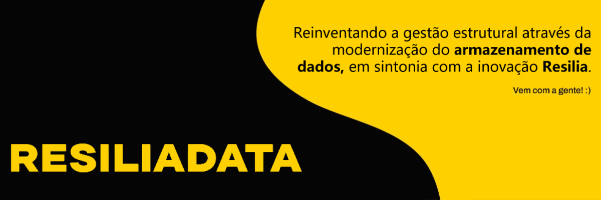

# Projeto Resilia - Banco de Dados

## Descrição
Este projeto faz parte do Módulo 3 da Resilia, com o objetivo de modernizar o processo de armazenamento de dados e gerenciamento da estrutura de ensino da empresa.

## Conteúdo do Projeto
- [Contexto](#contexto)
- [Requisitos](#requisitos)
- [Funcionalidades](#funcionalidades)
- [Estrutura do Projeto](#estrutura-do-projeto)
- [Modelo Conceitual](#modelo-conceitual)
- [Modelo Lógico](#modelo-lógico)
- [Guia do Projeto](#guia-do-projeto)
- [Como Executar](#como-executar)
- [Contribuidores](#contribuidores)
- [Licença](#licença)
- [Status](#status)
- [Download](#download)

## Contexto
O projeto envolve a modernizar o processo
de armazenamento de dados e construção para gerenciamento da estrutura
de ensino da empresa; 
Criação da modelagem do banco de dados, scripts SQL para criação e inserção de dados, além da execução de consultas estratégicas para a área de ensino da Resilia.

## Requisitos
- Representação das entidades e os respectivos atributos de cada uma delas;
- Modelagem completa do banco de dados com entidades, atributos e relacionamentos;
- Scripts SQL de criação do banco de dados e das respectivas tabelas com seus atributos e chaves;
- Scripts SQL de inserção dos dados nas respectivas tabelas;
- Scripts SQL com a resolução das 6 perguntas estratégicas da empresa.

## Funcionalidades
- Cadastro de Alunos, Facilitadores, Cursos e Turmas
- Consultas Estratégicas sobre os Dados
- Utilização de Banco de Dados para Armazenamento

## Estrutura do Projeto
O projeto está estruturado da seguinte forma:
- `index.py`: Contém o menu principal e a lógica de execução.
- `utils/`: Diretório com módulos utilitários.
  - `cores.py`: Cores para melhorar a apresentação no console.
  - `lines.py`: Funções para desenhar linhas decorativas.
  - `quiz.py`: Lógica relacionada ao quiz e armazenamento de dados.

## Modelo Conceitual

## Modelo Lógico

## Guia do Projeto
- [PDF com Instruções e Detalhes do Projeto](Doc/1694009852_SEDadosM3Projetoemgrupopdf.pdf)

## Download

## Como Executar
### Pré-requisitos

1. Clone o repositório para a sua máquina.

2. No diretório `C:/xampp`, crie uma pasta chamada "csv" e adicione todos os arquivos CSV necessários.

### Execução dos Scripts SQL

3. Execute os scripts SQL na seguinte ordem:

   - `RESILIADATA.sql`: Criação do banco de dados e tabelas.
   - `TRIGGER.sql`: Criação de triggers para atualizações no banco.
   - `INSERT.sql`: Inserção de dados nas tabelas.

### Consultas SQL

4. Execute as consultas SQL propostas para análise exploratória.

   - `SELECT.sql` (Opcional): Consultas adicionais para análise.
   - `VIEW.sql`: Criação de views para informações estratégicas.

## Contribuidores
- [Alessandro Brito](https://github.com/alsantosad)
- [Cássio Ramos](https://github.com/NewKanvas)
- [Felipe Damico](https://github.com/FelipeDamicoCapitao)
- [Xavier Flor](naoacheiolink)

## Licença

Este projeto é licenciado sob a [Licença MIT](LICENSE).

## Status

